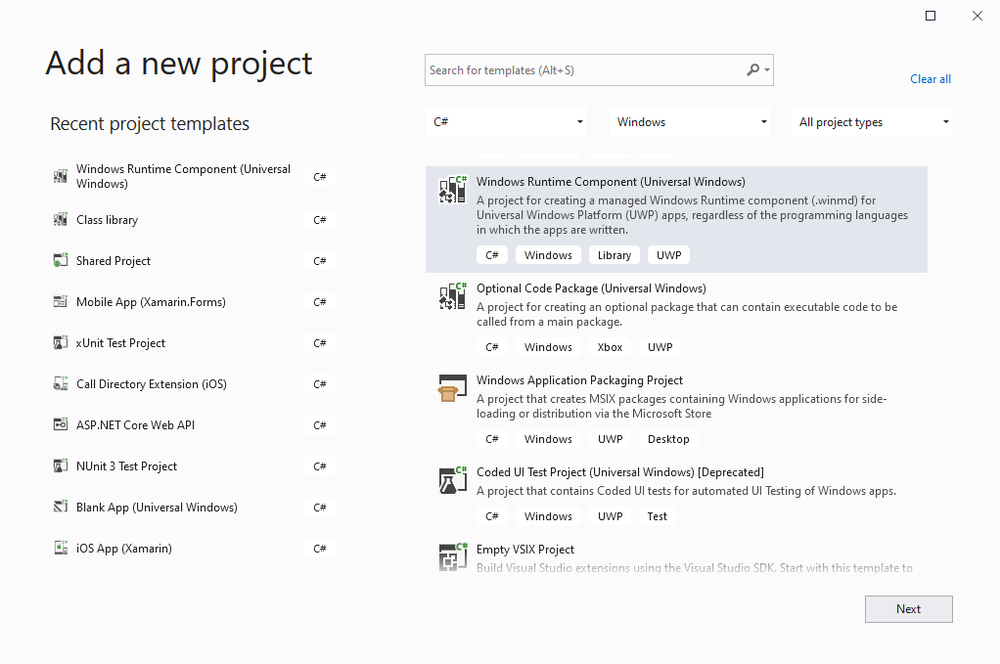

Title: Platform - UWP
Xref: uwp
Order: 5
---
# UWP

1. In order to process background tasks, you first need to create a "Windows Runtime Library" 



2. Add <?! PackageInfo "Shiny.Core" /?> nuget to this new library.

3. Add a references to your shared/netstandard library

4. Add a class and call the following hook to Shiny
```csharp
using System;
using Windows.ApplicationModel.Background;
using Shiny;


namespace Samples.UWP
{
    public sealed class MyShinyBackgroundTask : IBackgroundTask
    {
        public void Run(IBackgroundTaskInstance taskInstance)
            => this.ShinyRunBackgroundTask(taskInstance, new YourSharedLibrary.YourStartup());
    }
}

```

5. Now add this "Windows Runtime Library" as a reference to your head UWP project.


6. Add the following to your App.xaml.cs constructor in your head UWP project (Note the generic reference to your new runtime component)

```csharp
this.ShinyInit<YourShinyBackgroundTask>(new YourSharedLibrary.YourStartup());
```

7. In your Package.appxmanifest, add the following under the Application node (NOTE: the permissions you use will depend on the libraries from Shiny that you use)

```xml
<Extensions>
    <Extension Category="windows.backgroundTasks" EntryPoint="FullNamespaceToYour.ShinyBackgroundTask">
        <BackgroundTasks>
            <Task Type="bluetooth"/>
            <Task Type="deviceConnectionChange"/>
            <Task Type="deviceServicing"/>
            <Task Type="deviceUse"/>
            <Task Type="general"/>
            <Task Type="location"/>
            <Task Type="systemEvent"/>
            <Task Type="pushNotification"/>
            <Task Type="timer"/>
        </BackgroundTasks>
    </Extension>
</Extensions>
```
