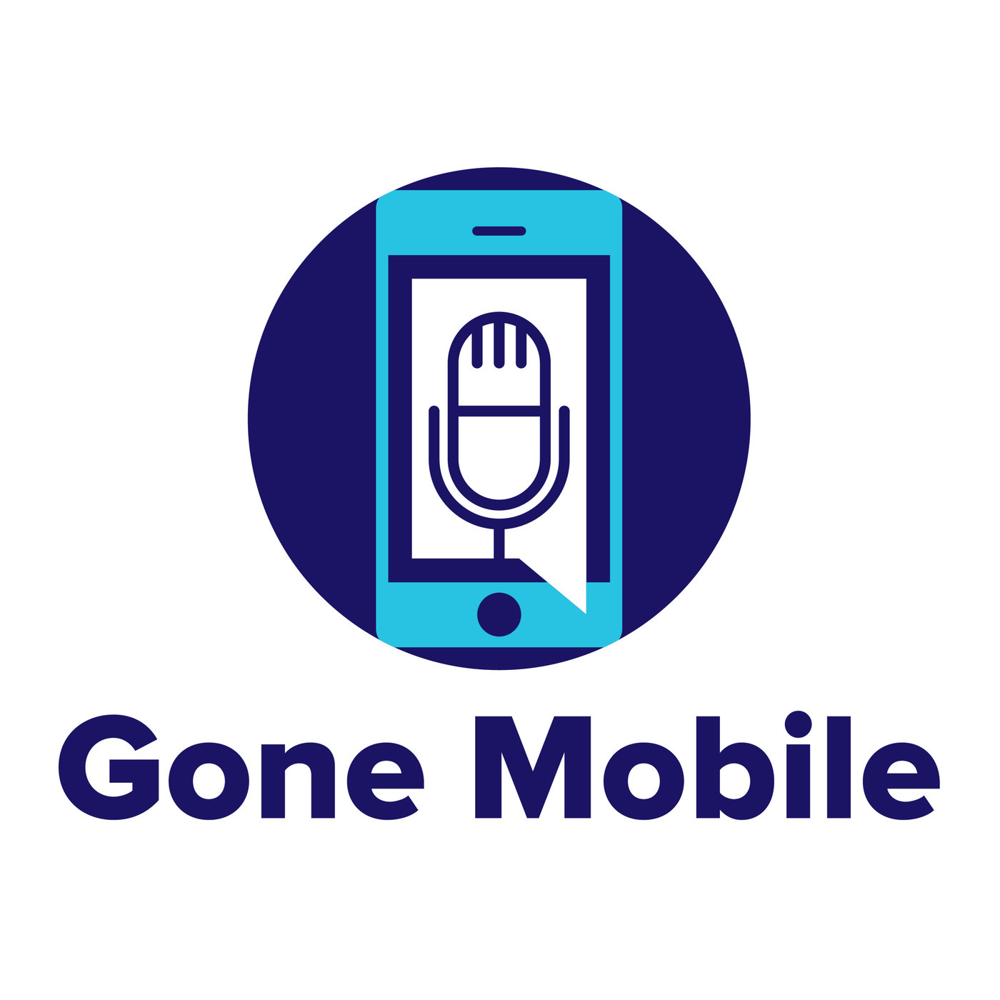

# Shiny v3 for .NET
 

Shiny is a cross platform framework designed to make working with device services and background processes easy, testable, and consistent while bringing
things like dependency injection & logging in a structured way to your code!

## Supports
* Xamarin iOS
* Xamarin Android
* .NET 8 for Android
* .NET 8 for iOS
* .NET 8 for MacCatalyst

## Features
* Handles all of the cruft like Permissions, main thread traversal, persistent storage and app restarts
* Brings your infrastructure to the background
* Provides logging to ensure you know when your services fail in the background 
* Gives a clean & testable API surface for your code
* Periodic Background Jobs
* BLE Client & Hosting
* Beacons Ranging & Monitoring
* Locations - GPS & Geofencing
* Push Notification - Native, Azure Notifications Hubs, Firebase, and more
* Local Notifications - best of breed local notifications supporting almost all features across all of the supported platforms

## Links
* [Documentation](https://shinylib.net)
* [Change Log](https://shinylib.net/release-notes/client/)
* [Community Support](https://github.com/shinyorg/shiny/discussions)
* [NuGets](https://www.nuget.org/profiles/ShinyLib)
* Samples
    * [MAUI - Kitchen Sink](https://github.com/shinyorg/shiny/tree/master/samples/Sample.Maui)
    * [Push](https://github.com/shinyorg/shiny/tree/master/samples/Sample.Push.Maui)
    * [BLE Client & Hosting](https://github.com/aritchie/digitalscoreboard)

## Visual Studio Templates

These templates will help get you up & running quickly.  Simply select what features of Shiny you want to use and they will wire up everything from permissions to app configuration.

[GitHub](https://github.com/shinyorg/templates)

> dotnet new --install Shiny.Templates

## Integrating With Existing Apps

If you cannot use our awesome templates - try our ugly, but effective boilerplate builder at:
[https://shinylib.net/client/appbuilder/](https://shinylib.net/client/appbuilder/)

## Support Shiny!

While Shiny is free and will continue to be so, maintenance and support takes a heavy toll on sustainability. If you or your company have the resources, please consider becoming a GitHub Sponsor. GitHub Sponsorships help to make Open Source Development more sustainable.

Depending on your Sponsorship Tier, you may also get access to some great benefits on Sponsor Connect (https://sponsorconnect.dev) including:
- The Sponsor Only Discord server
- Training available ONLY to sponsors on Sponsor Connect
- Special sponsor-only packages

[https://sponsor.shinylib.net](https://sponsor.shinylib.net)

How about some [Shiny Gear](https://www.redbubble.com/shop/ap/45038461)

## Premium Paid Support

Looking for consulting for your .NET applications and Shiny, you can now book a time with Allan Ritchie on here: [1-1 Consulting Session](https://superpeer.com/allanritchie/-/1-on-1-development-help)

## Contributors
* [Allan Ritchie](https://github.com/aritchie) - Project Lead
* [Dan Siegel](https://github.com/dansiegel) - Contributor
* [Emily Stanek](https://github.com/emilystanek) - Logo Designer

## Podcasting
For more info on Shiny and other great .NET content, listen to [Jon Dick (aka Redth)](https://github.com/redth) and [Allan Ritchie (Author of Shiny)](https://github.com/aritchie) every week at:

